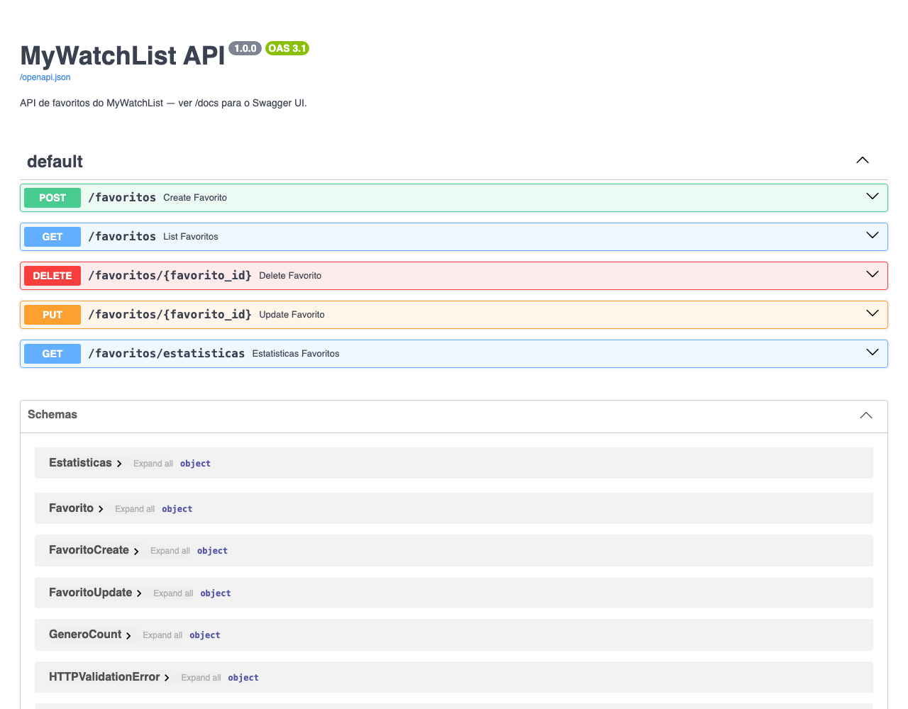
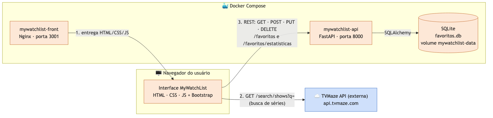

# 📺 MyWatchList API

> API REST que guarda a sua lista de séries favoritas: nota, comentário, filtros e estatísticas.

Back-end do **MyWatchList**, um organizador pessoal de séries. Esta API persiste em **SQLite** as séries que o usuário marcou como favoritas (vindas da busca na [TVMaze](https://www.tvmaze.com/api), feita pelo front-end), com nota de 1 a 5 e comentário opcional. Também entrega a lista filtrada e ordenada e um resumo estatístico para o painel da interface.

É o **componente secundário** do MVP da Sprint 4 da Pós-Graduação em Engenharia de Software da PUC-Rio:

| Componente | Papel | Repositório |
|---|---|---|
| **mywatchlist-front** | Interface do usuário (componente principal) | https://github.com/AldySouza/mvp-sprint-4-mywatchlist-front |
| **mywatchlist-api** (este) | API REST + banco SQLite | https://github.com/AldySouza/mvp-sprint-4-mywatchlist-api |
| **TVMaze API** | API externa pública, consumida pelo front | https://www.tvmaze.com/api |



---

## Sumário

- [Rotas](#-rotas)
- [Modelo de dados](#-modelo-de-dados)
- [Arquitetura](#-arquitetura)
- [Como rodar](#-como-rodar)
- [Testes](#-testes)
- [Estrutura de pastas](#-estrutura-de-pastas)
- [Tecnologias](#-tecnologias)

---

## 🔌 Rotas

Com a API rodando, a documentação interativa (**Swagger UI**) fica em **http://localhost:8000/docs**, onde dá para testar todas as rotas no navegador.

| Método | Rota | Descrição | Sucesso | Erros |
|---|---|---|---|---|
| `POST` | `/favoritos` | Salva uma série nos favoritos | `201` | `422` dados inválidos |
| `GET` | `/favoritos` | Lista os favoritos, com filtro e ordenação opcionais | `200` | `422` `sort_by` inválido |
| `GET` | `/favoritos/estatisticas` | Resumo da lista: total, média, notas e gêneros | `200` | — |
| `PUT` | `/favoritos/{id}` | Atualiza nota e/ou comentário | `200` | `404` não existe · `422` nota inválida |
| `DELETE` | `/favoritos/{id}` | Remove um favorito | `204` | `404` não existe |

Além do CRUD básico, a API oferece:

- **Filtro por gênero:** `?genre=Drama`, sem diferenciar maiúsculas de minúsculas. Séries com vários gêneros aparecem em todos eles.
- **Ordenação:** por padrão, os mais recentes vêm primeiro. Com `?sort_by=rating`, a lista vem da maior nota para a menor. Os dois parâmetros podem ser combinados.
- **Estatísticas agregadas** para o painel do front.
- **Validação** com Pydantic: nota entre 1 e 5, nome e gêneros obrigatórios.
- **Carga inicial:** 5 séries reais da TVMaze são inseridas na primeira execução, com o banco vazio.

### Exemplos

**Criar um favorito**

```bash
curl -X POST http://localhost:8000/favoritos \
  -H "Content-Type: application/json" \
  -d '{
        "name": "Breaking Bad",
        "genres": ["Drama", "Crime", "Thriller"],
        "rating": 5,
        "comment": "Um dos maiores dramas já feitos.",
        "image_url": "https://static.tvmaze.com/uploads/images/medium_portrait/501/1253519.jpg",
        "external_id": 169
      }'
```

```json
{
  "id": 6,
  "name": "Breaking Bad",
  "genres": ["Drama", "Crime", "Thriller"],
  "rating": 5,
  "comment": "Um dos maiores dramas já feitos.",
  "image_url": "https://static.tvmaze.com/uploads/images/medium_portrait/501/1253519.jpg",
  "external_id": 169,
  "created_at": "2026-09-22T17:30:00"
}
```

**Listar só dramas, da maior nota para a menor**

```bash
curl "http://localhost:8000/favoritos?genre=Drama&sort_by=rating"
```

**Editar nota e apagar o comentário**

```bash
curl -X PUT http://localhost:8000/favoritos/6 \
  -H "Content-Type: application/json" \
  -d '{"rating": 4, "comment": null}'
```

No `PUT`, campo omitido mantém o valor atual, e `"comment": null` apaga o comentário. Só `rating` e `comment` podem ser editados.

**Estatísticas**

```bash
curl http://localhost:8000/favoritos/estatisticas
```

```json
{
  "total": 5,
  "media_notas": 4.4,
  "por_nota": { "1": 0, "2": 0, "3": 0, "4": 3, "5": 2 },
  "por_genero": [
    { "genero": "Drama", "total": 3 },
    { "genero": "Comedy", "total": 2 }
  ]
}
```

**Remover**

```bash
curl -X DELETE http://localhost:8000/favoritos/6   # 204 No Content
```

---

## 🗃️ Modelo de dados

Tabela `favoritos` (SQLite, via SQLAlchemy):

| Campo | Tipo | Obrigatório | Observação |
|---|---|---|---|
| `id` | inteiro | auto | Chave primária |
| `name` | texto | ✔ | Nome da série |
| `genres` | texto | ✔ | Guardado como `"Drama,Crime"`; entra e sai da API como lista |
| `rating` | inteiro | ✔ | Nota de 1 a 5 |
| `comment` | texto | | Comentário livre |
| `image_url` | texto | | URL da capa (TVMaze) |
| `external_id` | inteiro | | ID da série na TVMaze |
| `created_at` | data/hora | auto | Define a ordenação padrão |

---

## 🏗️ Arquitetura



<sub>🟧 módulos implementados neste MVP · 🟦 módulo externo consumido.</sub>

A interface (rodando no navegador) chama esta API via REST/JSON. A API grava no SQLite, que no Docker fica no volume `mywatchlist-data`, montado em `/app/data`. Assim os dados sobrevivem quando o container é recriado. A TVMaze é consumida direto pelo front. O CORS está liberado porque a interface roda em outra origem (porta 3001).

---

## 🚀 Como rodar

### Opção 1: script `start` (recomendado)

Funciona num computador **sem nada instalado**. O script:

1. verifica se há um **Python 3.10 a 3.13** e, se não houver, instala o Python 3.12 (Homebrew ou python.org no macOS; `apt`/`dnf`/`pacman`/… no Linux; `winget` ou python.org no Windows);
2. verifica se o **Docker** está instalado e rodando; se não estiver instalado, instala (Docker Desktop no macOS/Windows, Docker Engine no Linux) e tenta iniciá-lo;
3. com o Docker pronto, builda a imagem e sobe a API num container;
4. se o Docker não ficar pronto (por exemplo, recém-instalado e pedindo reinicialização ou novo login), sobe a API **com Python local**: cria a `.venv`, instala o `requirements.txt` e roda o servidor.

| Sistema | Comando |
|---|---|
| macOS / Linux | `./start.sh` |
| Windows (duplo clique ou CMD) | `start.bat` |
| Windows (PowerShell) | `.\start.ps1` |

Acesse **http://localhost:8000/docs**. Para parar: `Ctrl+C`.

- **Sem Docker, direto com Python local:** `./start.sh --local` (Windows: `start.bat -Local` ou `.\start.ps1 -Local`).
- **Outra porta:** `PORT=9000 ./start.sh` (Windows PowerShell: `$env:PORT=9000; .\start.ps1`).
- A instalação de Python/Docker pode pedir a senha de administrador. Nas execuções seguintes nada é reinstalado: a `.venv` só é recriada se estiver quebrada e as dependências só são reinstaladas se o `requirements.txt` mudar.

> **Aplicação completa (front + API):** use o `start` do repositório [mywatchlist-front](https://github.com/AldySouza/mvp-sprint-4-mywatchlist-front#-como-rodar), que sobe os dois componentes juntos.

### Opção 2: passo a passo manual com Python

Faz o mesmo que o `start --local`, um comando por vez.

**1. Instale o Python 3.12** (qualquer versão de 3.10 a 3.13 serve; a 3.14 ainda não tem pacotes prontos de algumas dependências). Confira com `python3 --version` (Windows: `py -3.12 --version`). Se não tiver:

| Sistema | Comando |
|---|---|
| macOS (Homebrew) | `brew install python@3.12` |
| Ubuntu / Debian | `sudo apt-get install python3.12 python3.12-venv` |
| Fedora | `sudo dnf install python3.12` |
| Windows | `winget install -e --id Python.Python.3.12` |

Ou baixe o instalador em https://www.python.org/downloads/.

**2. Baixe o código e entre na pasta**

```bash
git clone https://github.com/AldySouza/mvp-sprint-4-mywatchlist-api.git mywatchlist-api
cd mywatchlist-api
```

**3. Crie e ative o ambiente virtual (*virtualenv*)**

```bash
# macOS / Linux
python3.12 -m venv .venv
source .venv/bin/activate
```

```powershell
# Windows (PowerShell)
py -3.12 -m venv .venv
.venv\Scripts\Activate.ps1
# no CMD: .venv\Scripts\activate.bat
```

**4. Instale as dependências**

```bash
pip install -r requirements.txt
```

**5. Suba o servidor**

```bash
uvicorn app.main:app --port 8000
# durante o desenvolvimento, --reload reinicia a cada alteração no código
```

Acesse **http://localhost:8000/docs**. Para parar: `Ctrl+C`; para sair da *virtualenv*: `deactivate`.

Sem Docker, o banco é criado em `./favoritos.db`. Para usar outro caminho, defina a variável `DATABASE_URL` (ex.: `sqlite:///./outro.db`).

### Opção 3: passo a passo manual com Docker

Pré-requisito: [Docker](https://docs.docker.com/get-docker/) instalado e rodando.

```bash
docker build -t mywatchlist-api .
docker run --rm -p 8000:8000 -v mywatchlist-data:/app/data mywatchlist-api
```

O banco fica no volume `mywatchlist-data`, então os favoritos continuam lá quando o container é recriado.

---

## 🧪 Testes

| Sistema | Comando |
|---|---|
| macOS / Linux | `./test.sh` |
| Windows (duplo clique ou CMD) | `test.bat` |
| Windows (PowerShell) | `.\test.ps1` |

O script garante o Python (instala se faltar), prepara a `.venv` do mesmo jeito que o `start`, instala as dependências de dev e roda o `pytest`. Argumentos extras vão direto para o pytest, por exemplo `./test.sh tests/contract -v`.

**Manualmente**, com a *virtualenv* dos passos 1–3 acima ativada:

```bash
pip install -r requirements-dev.txt
pytest
```

São 22 testes, cada um com banco SQLite em memória isolado:

- **Contrato** (`tests/contract/`): formato de request e response e códigos HTTP de cada rota.
- **Integração** (`tests/integration/`): fluxos completos, como criar, listar com filtro e ordenação, editar e remover.

---

## 📁 Estrutura de pastas

```
mywatchlist-api/
├── app/
│   ├── main.py          # App FastAPI: rotas, CORS e carga inicial
│   ├── models.py        # Modelo SQLAlchemy (tabela favoritos)
│   ├── schemas.py       # Schemas Pydantic (entrada, saída, validação)
│   └── database.py      # Engine, sessão e DATABASE_URL
├── tests/
│   ├── conftest.py      # Fixture com banco em memória
│   ├── contract/        # Testes de contrato por rota
│   └── integration/     # Testes de fluxo
├── docs/                # Diagrama e captura do Swagger
├── Dockerfile
├── requirements.txt     # Dependências de produção
├── requirements-dev.txt # + pytest/httpx para testes
├── start.sh / .bat / .ps1   # Verifica/instala Python e Docker e sobe a API
└── test.sh / .bat / .ps1    # Roda os testes (venv + pytest)
```

---

## 🛠️ Tecnologias

- **[Python 3.12](https://www.python.org/)** + **[FastAPI](https://fastapi.tiangolo.com/)**, com Swagger gerado automaticamente
- **[SQLAlchemy 2](https://www.sqlalchemy.org/)** + **SQLite**
- **[Pydantic 2](https://docs.pydantic.dev/)**: validação
- **[Uvicorn](https://www.uvicorn.org/)**: servidor ASGI
- **Pytest + HTTPX**: testes
- **Docker**

---

<sub>MVP da Sprint 4 (Arquitetura de Software), Pós-Graduação em Engenharia de Software, PUC-Rio.</sub>
